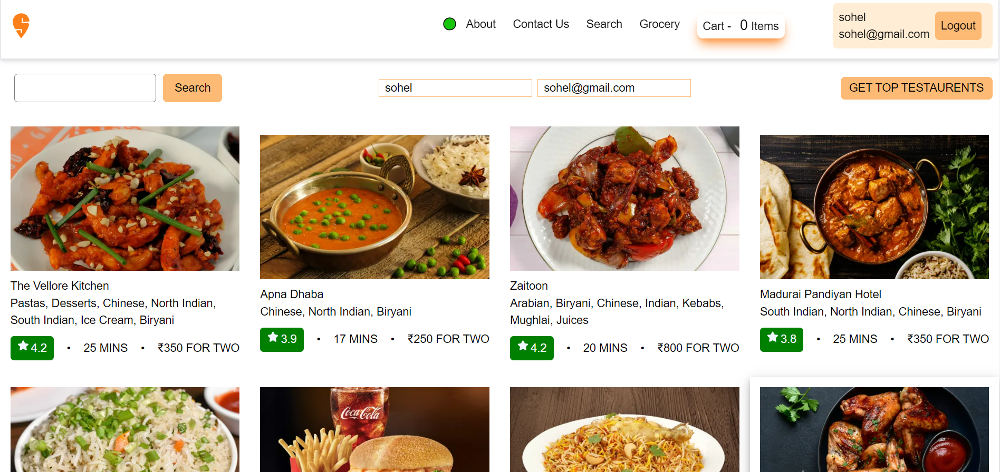

# foodStore

# Steps to run the application
- npm install
- npm start

# Technologies used to create the application
- React
- Parcel
- Redux-toolkit
- Tailwind-CSS
- Swiggy Live API(GET) for Data fetch
